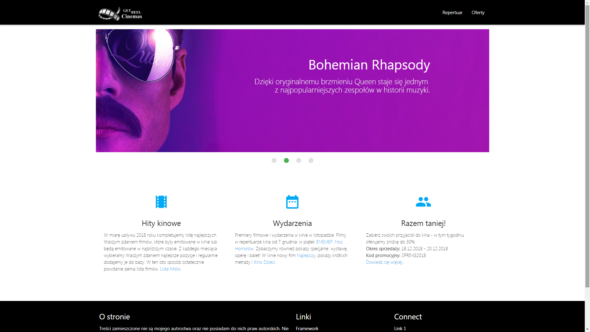
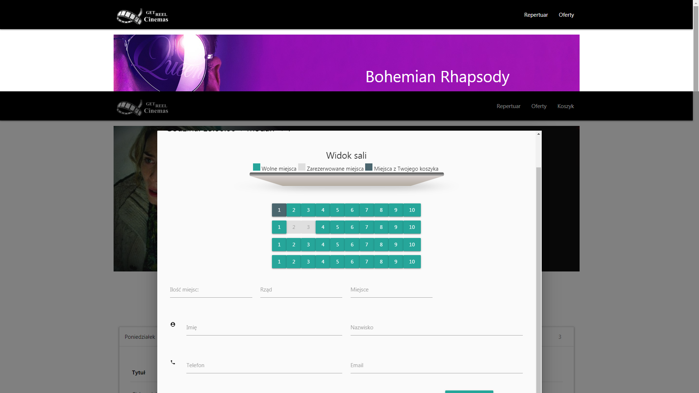
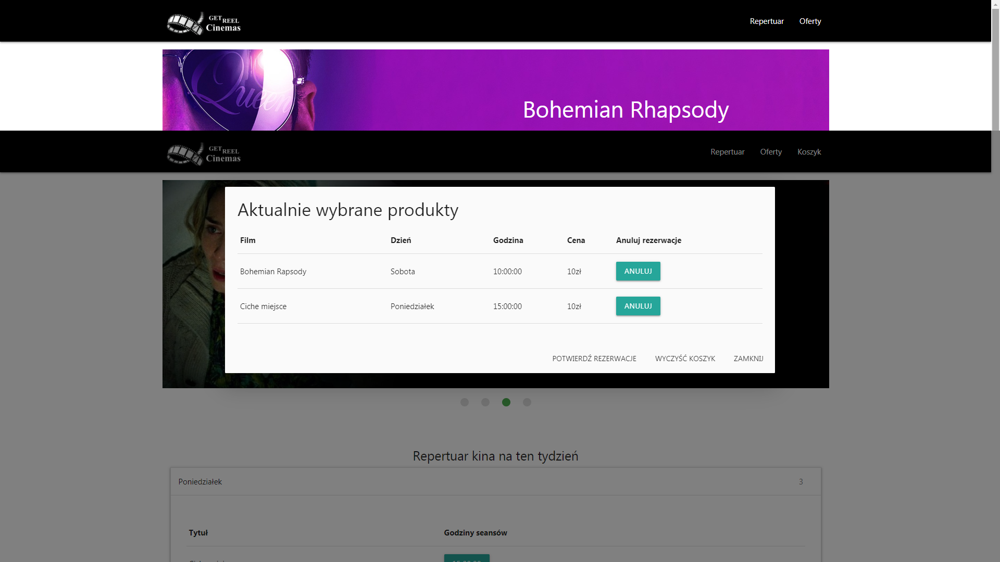
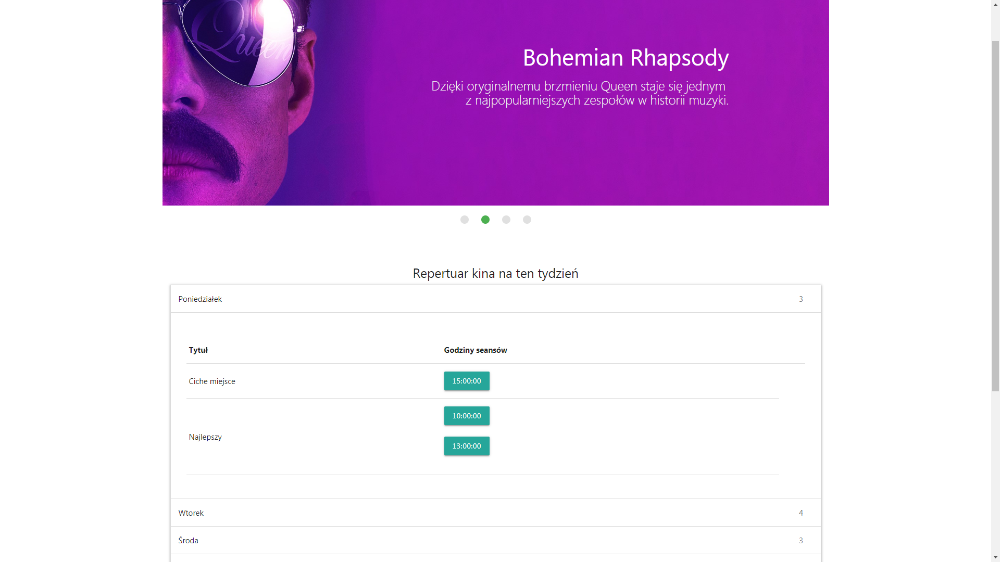

# Cinema Page

Easy and simple web page to cinema. Created using:

* [Materialize] - based on Starter Template.
* [PHP] - customer session and purchase of tickets.
* [MySQL] - database.

### Installation

This page requires XAMPP to run. Install it and start the server. Using localhost to create database **kino1** and use it 
```sh
CREATE DATABASE kino1;
USE kino1;
```
and then import **kino1.sql**

### Page appearance

#### Index
 
 
#### Purchase of tickets
 
#### Shopping cart
 
#### Cinema offer
 
#### Cinema repertoire
 

[Materialize]: <https://materializecss.com/getting-started.html>